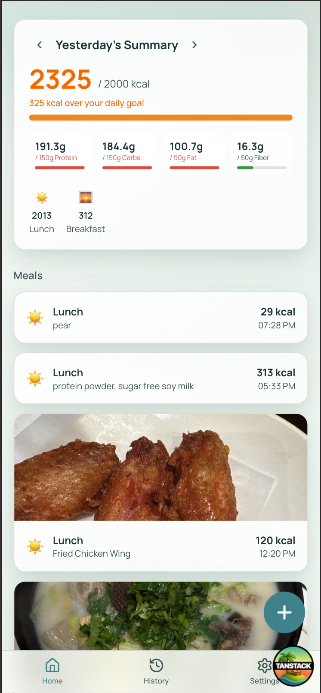
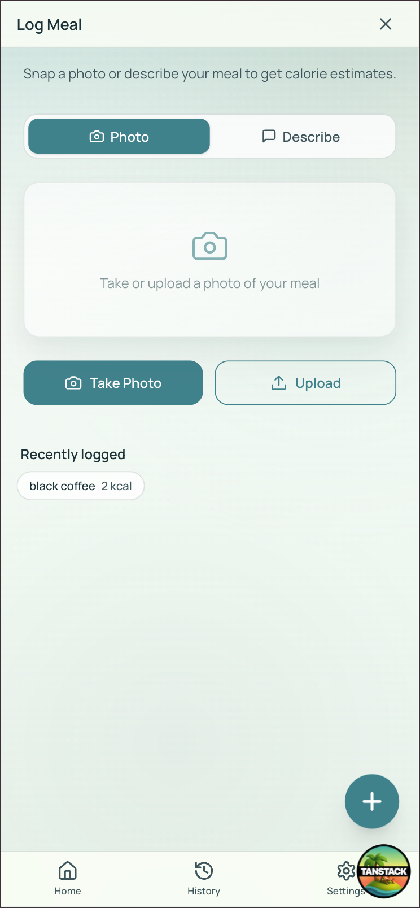
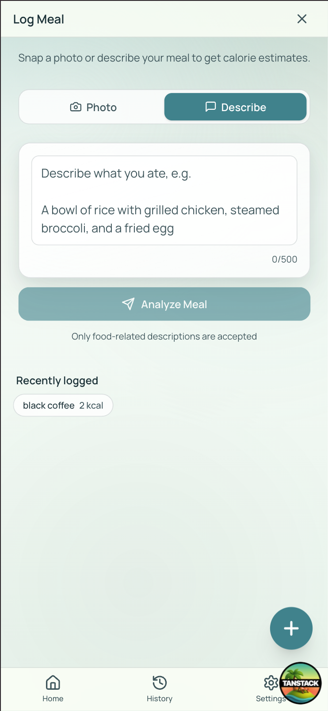
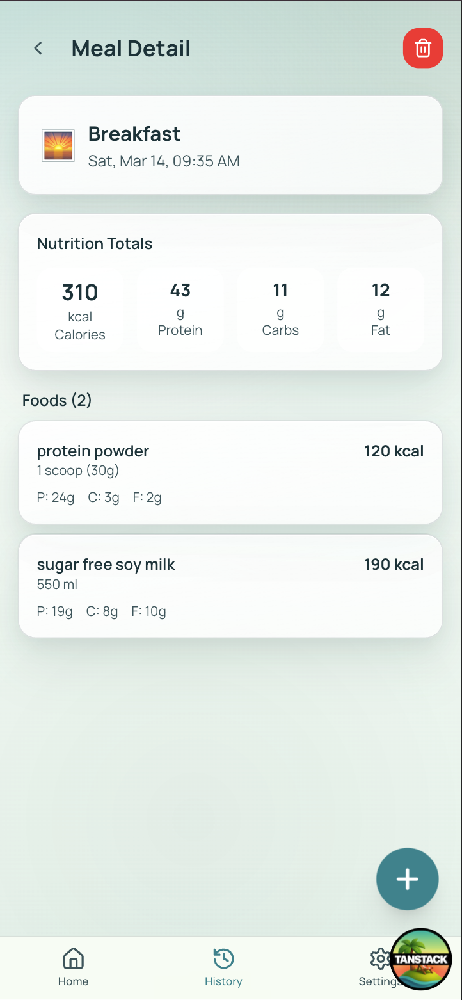
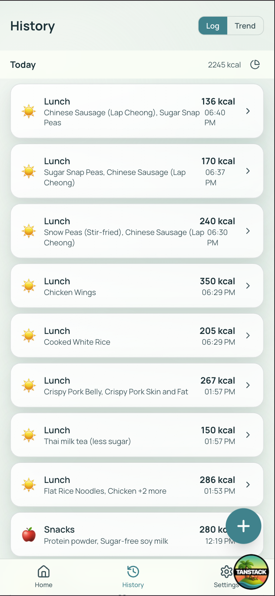
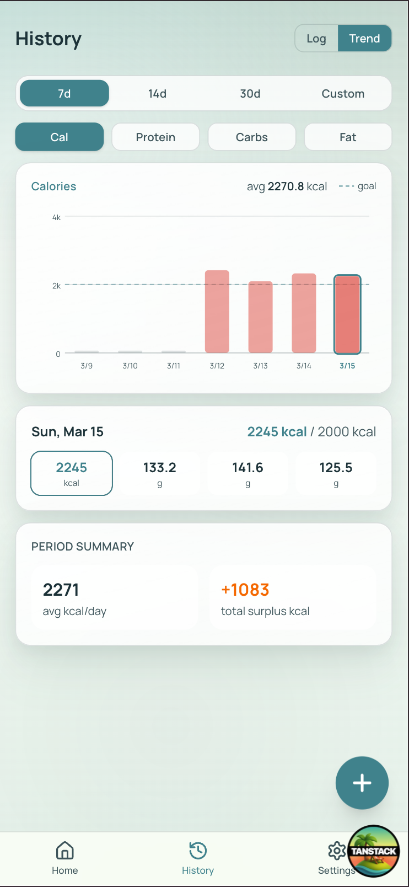
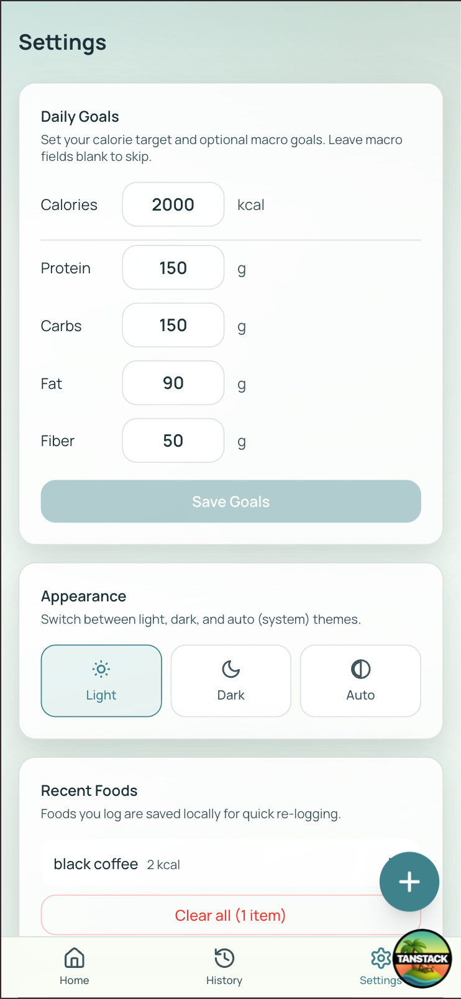

# Calo — AI Calorie Tracker

A mobile-first calorie and nutrition tracking app powered by Google Gemini AI. Snap a photo of your meal or describe it in text and get instant nutritional breakdowns.

---

## Features

- **AI Food Analysis** — Take a photo or describe your meal; Gemini 2.5 Flash identifies every food item and estimates calories, protein, carbs, fat, and fiber
- **Photo Upload** — Meal images are compressed to WebP client-side and stored in Cloudflare R2
- **Manual Adjustments** — Tweak any food item after analysis (e.g. "half of it", "coke zero", "skip rice")
- **Daily Summary** — Home screen shows today's total calories, macros, and a progress bar against your daily goal
- **Calorie Goal Warning** — A warning banner appears during meal review if the meal would exceed your daily calorie goal
- **Meal History** — Infinite scroll history grouped by date; tap any meal for full detail
- **Undo Delete** — Deleting a meal shows a 5-second countdown toast with an undo button before the deletion is committed
- **Period Analytics** — 7/30/90-day trend chart with an insights card showing average calories, total surplus/deficit, days logged, and macro warnings
- **Macro Warnings** — Alerts when protein, carbs, fat, or fiber averaged below 70% of your goal over a period (requires ≥3 days logged)
- **Meal Tags** — Categorise meals as Breakfast, Lunch, Dinner, or Snacks
- **Daily & Macro Goals** — Set calorie target plus optional protein, carbs, fat, and fiber goals in Settings
- **Recent Foods** — Foods you log are cached locally for one-tap re-logging; manage or clear them from Settings
- **Dark / Light / Auto Theme** — Follows system preference by default
- **Authentication** — Email & password sign-up / sign-in via Better Auth
- **Rate Limit Feedback** — When AI analysis is rate-limited, the error message shows the exact seconds remaining before retry

---

## Tech Stack

### Frontend
| | |
|---|---|
| Framework | [TanStack Start](https://tanstack.com/start) (React 19, SSR) |
| Routing | [TanStack Router](https://tanstack.com/router) (file-based) |
| Styling | [Tailwind CSS v4](https://tailwindcss.com) |
| Forms | [React Hook Form](https://react-hook-form.com) + [Zod](https://zod.dev) |

### Backend
| | |
|---|---|
| Server Functions | TanStack Start `createServerFn` |
| Database | PostgreSQL via [Railway](https://railway.app) |
| ORM | [Drizzle ORM](https://orm.drizzle.team) |
| Auth | [Better Auth](https://www.better-auth.com) |
| Image Storage | [Cloudflare R2](https://developers.cloudflare.com/r2) (S3-compatible) |
| AI | [Google Gemini 2.5 Flash](https://ai.google.dev) (`@google/generative-ai`) |

### Tooling
| | |
|---|---|
| Package Manager | pnpm |
| Build | Vite 7 |
| Linting | oxlint |
| Testing | Vitest + Testing Library |
| Git Hooks | Husky + lint-staged |

---

## Screenshots

<table>
  <tr>
    <td align="center"><b>Home</b></td>
    <td align="center"><b>Log — Photo</b></td>
    <td align="center"><b>Log — Describe</b></td>
    <td align="center"><b>Meal Detail</b></td>
  </tr>
  <tr>
    <td></td>
    <td></td>
    <td></td>
    <td></td>
  </tr>
  <tr>
    <td align="center"><b>History — Log</b></td>
    <td align="center"><b>History — Trend</b></td>
    <td align="center"><b>Settings</b></td>
    <td></td>
  </tr>
  <tr>
    <td></td>
    <td></td>
    <td></td>
    <td></td>
  </tr>
</table>

---

## Getting Started

### 1. Install dependencies

```bash
pnpm install
```

### 2. Set up environment variables

```bash
cp .env.example .env
```

Fill in all values in `.env` — see `.env.example` for the full list.

### 3. Run database migrations

```bash
pnpm db:migrate
```

### 4. Start the dev server

```bash
pnpm dev
```

App runs at `http://localhost:3000`.

---

## Environment Variables

See `.env.example` for all required variables. Key ones:

| Variable | Description |
|---|---|
| `DATABASE_URL` | PostgreSQL connection string |
| `BETTER_AUTH_SECRET` | Secret key for Better Auth session signing |
| `GEMINI_API_KEY` | Google Gemini API key |
| `R2_ACCOUNT_ID` | Cloudflare account ID |
| `R2_ACCESS_KEY_ID` | R2 access key |
| `R2_SECRET_ACCESS_KEY` | R2 secret key |
| `R2_BUCKET_NAME` | R2 bucket name |
| `R2_PUBLIC_URL` | Public base URL for the R2 bucket |

---

## Database

```bash
pnpm db:generate   # generate migration from schema changes
pnpm db:migrate    # apply migrations
pnpm db:studio     # open Drizzle Studio GUI
```

---

## Project Structure

```
src/
├── components/
│   ├── log/                # Food logging UI components
│   ├── CalorieTrendChart.tsx   # Period trend chart (uses SvgBarChart + InsightsCard)
│   ├── InsightsCard.tsx        # Period analytics summary (avg kcal, surplus/deficit, macro warnings)
│   ├── NutrientCard.tsx        # Single macro display card (reused in meal detail)
│   ├── SvgBarChart.tsx         # SVG bar chart primitive
│   └── UndoToast.tsx           # 5-second undo toast with progress bar
├── db/
│   ├── index.ts            # Drizzle client + pg connection pool
│   └── schema.ts           # Database schema & indexes
├── lib/
│   ├── analytics.ts        # computeInsights() — weekly/monthly analytics logic
│   ├── env.ts              # Startup environment validation
│   ├── nutrition.ts        # calcTotals, roundMacro helpers
│   ├── recent-foods.ts     # localStorage recent-foods cache with useSyncExternalStore
│   ├── timezone.ts         # localDateToUTC() — DST-safe datetime conversion
│   ├── types.ts            # Shared types & constants
│   └── server/
│       ├── meals.ts        # Meal CRUD + Gemini AI analysis
│       ├── session.ts      # Shared auth session helper
│       ├── settings.ts     # User settings (calorie + macro goals)
│       └── upload.ts       # R2 presigned URL generation
├── routes/
│   ├── __root.tsx               # Root layout + error boundary
│   ├── _authenticated.tsx       # Auth guard layout
│   ├── _authenticated/
│   │   ├── index.tsx            # Home (today's summary)
│   │   ├── log.tsx              # Log a meal
│   │   ├── history.index.tsx    # Meal history
│   │   ├── history.$mealId.tsx  # Meal detail + undo delete
│   │   └── settings.tsx         # User settings + recent foods manager
│   ├── sign-in.tsx
│   └── sign-up.tsx
└── styles.css
```

---

## Scripts

```bash
pnpm dev          # start dev server
pnpm build        # production build
pnpm start        # run production build
pnpm test         # run tests
pnpm lint         # lint with oxlint
```
